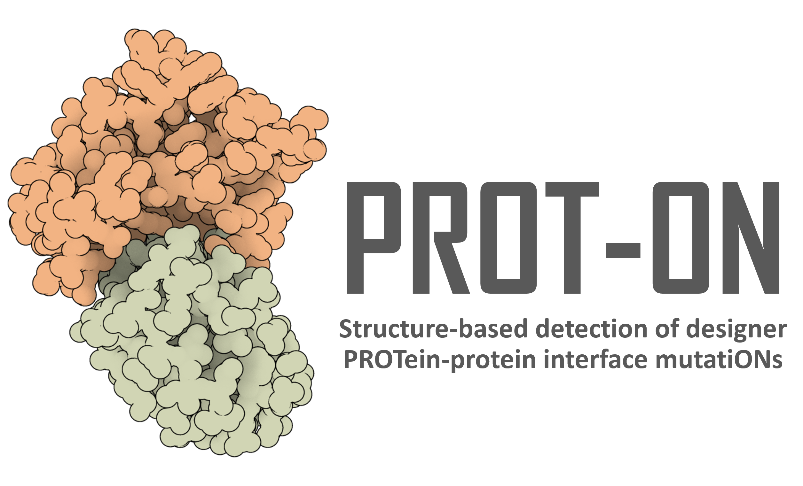
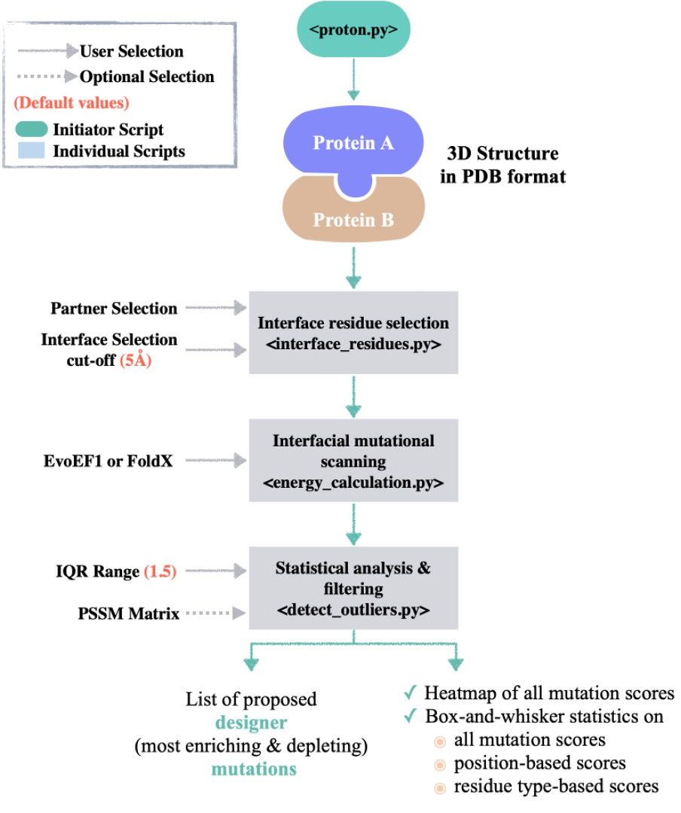
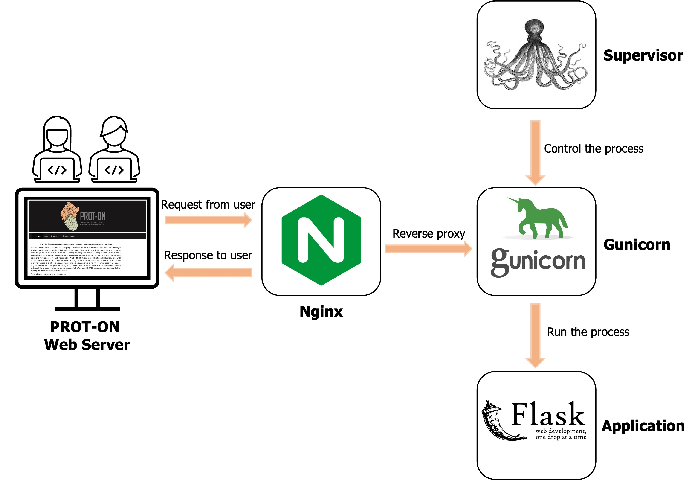
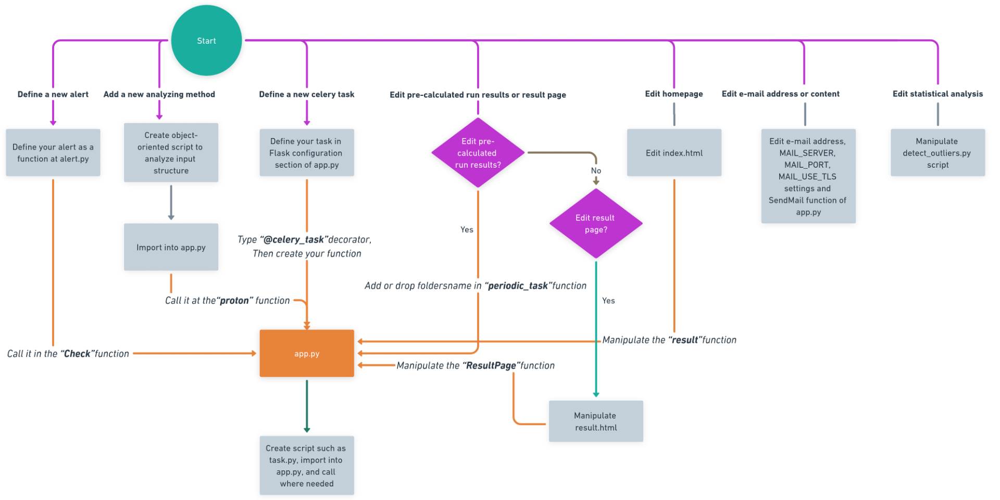

<p align="center">
  
</p>

[](https://doi.org/10.3389/fmolb.2023.1063971)


### PROT-ON: A Structure-Based Detection of Designer PROTein Interface MutatiONs

### Background

PROT-ON aims to identify key protein-protein interaction (PPI) mutations that can aid in redesigning new protein binders. It accomplishes this by using the coordinates of a protein complex to explore all possible interface mutations on a selected protein monomer with either [EvoEF1](https://github.com/tommyhuangthu/EvoEF) or [FoldX](http://foldxsuite.crg.eu/). The resulting mutational landscape is then filtered based on stability and, optionally, mutability criteria. Finally, PROT-ON performs a statistical analysis of the energy landscape created by the mutations to suggest the most enriching and depleting interfacial mutations for binding. PROT-ON can work on both [stand-alone](https://github.com/CSB-KaracaLab/prot-on) and [PROT-ON webserver](http://proton.tools.ibg.edu.tr:8001).

### PROT-ON Architecture

#### Code Architecture

The PROT-ON tool is designed with a modular architecture that includes the following components:
1. **Interface Analysis**: Identifying interfacial amino acids.  (`interface_residues.py`).
2. **Mutation Modeling**: Using EvoEF1 and FoldX to generate mutants and calculate binding energies  (`energy_calculation_[EvoEF/FoldX].py`).
3. **Statistical Analysis**: Classifying the mutations based on their impact on binding energy  (`detect_outliers.py`).

<p align="center">

</p>

#### Webserver Architecture

PROT-ON's web application was developed using Flask, Bootstrap, HTTP, CSS, JavaScript, Celery, RabbitMQ, SQLAlchemy, Nginx, Gunicorn, and Supervisor packages and services. These packages and services handle the jobs provided below.

1. **Frontend**: HTML, CSS, and JavaScript, Bootstrap for the user interface.
2. **Backend**: Python scripts and [Flask](https://flask.palletsprojects.com/en/3.0.x/) for handling requests and running the mutation analysis.
3. **Database**: Storing data with SQLAlchemy.
4. **Task Queue**: Using [RabbitMQ](https://www.rabbitmq.com/tutorials/tutorial-one-python) and [Celery](https://docs.celeryq.dev/en/stable/) for managing background tasks.
5. **Server**: Deploying the webserver with [Nginx](https://nginx.org/en/docs/), supervisor and gunicorn.

<p align="center">

</p>

<p align="center">

</p>

### Usage

#### System dependencies
* Note that you must remove and re-install all system dependency packages if you re-download the PROT-ON Web package.

* python3 OR conda (version 4.10 or higher)
* Linux
* [FoldX 4.0](http://foldxsuite.crg.eu/) (optional)
* RabbitMQ
* Nginx
* Supervisor
* Celery

### Python dependencies (also listed in requirements.txt)
* Flask
* Celery
* Plotly
* Python-dotenv
* SQLAlchemy
* Request
* Pandas
* Numpy
* Kaleido
* Flask-mail
* Gunicorn

#### Clone Repository

```
git clone https://github.com/mehdikosaca/prot-on_web.git
```
```
cd prot-on_web
```

PROT-ON will deploy to your IP/domain address after completing these instructions. If you prefer to deploy it on a specific domain, please enter your domain as a string in the `hostname` variable within `app.py` (PROT-ON's default domain is proton.tools.ibg.edu.tr:8001). You can also change the e-mail address to which the results are sent. For this, please search `Fill with your e-mail here` in `app.py` script using `command/ctrl + f` and edit your e-mail. Also if needed, you must change `MAIL_PORT`. 

### Quick Installation

You can run the script (`setup_prot-on.sh`) to quickly deploy the PROT-ON web server. Or you can follow [instuctions](/Step_by_Step_Deploying.md) to deploy the server step by step.

#### To Run the PROT-ON Webserver

Open two separate terminal tabs on the PROT-ON working directory, and run the following commands to start background and scheduled tasks, respectively. These commands should be run out of the environment. 
```
celery -A app.celery worker --loglevel=info &
```
```
celery -A app.celery beat --loglevel=info
```

### PROT-ON Output Files

* **Mutation models Folder:** Stores the mutant models modeled by EvoEF1 or FoldX. The commands that generate the mutant models are `BuildMutant` and `BuildModel`, respectively for EvoEF1 and FoldX.
  
* **Interface amino acid list:** Amino acids within a defined cut-off are listed (calculated by `interface_residues.py`) as interfacial amino acids with their corresponding input chain IDs. Also, the pairwise contacts are calculated by the `interface_residues.py` script and saved as a pairwise distance list.

* **Individual EvoEF1/FoldX files:** Binding affinity predictions are stored in this folder. Binding affinities are calculated preferably by EvoEF1 or FoldX.  The commands that calculate the predicted binding affinities are `ComputeBinding` ad `AnalyseComplex`, respectively for EvoEF1 and FoldX (proton_scores).

* **Boxplot of EvoEF1/FoldX scores:** All binding affinity predictions are analyzed with the box-whisker statistics.

* **Depleting mutations:** The positive outliers are listed as depleting mutations.

* **Enriching mutations:** The negative outliers are listed as enriching mutations.

* **Heatmap of PROT-ON scores:** A heatmap to visualize all possible mutation energies, highlighting depleting and enriching mutations.

* **Filtered mutations:** Stability-filtered (uses ComputeStability command of EvoEF1 or Stability command of FoldX, where DDG-stability<0) enriching and depleting mutations and optionally PSSM-filtered (Enriching mutations with PSSM-score >0 && Depleting mutations with PSSM-score <=0).

* **Heatmap_df:** A data frame used to generate the heatmap.

* **Parameters:** Includes the submitted cut-off and IQR ranges.

### For Future Updates

This section includes valuable information for future updates of PROT-ON codes. If you want to update anything, please follow the below instructions.

* **To define a new alert:** First, define your alert code as a function in `alert.py`, then call it in the "Check" function in the `app.py` script. ([See for more information](https://flask.palletsprojects.com/en/1.1.x/patterns/flashing/)) 

* **To add a new analyzing method:** If you want to add a new analysis method to PROT-ON, you must first create an object-oriented script to analyze the input structure, similar to __energy_calculation_EvoEF1.py__. Then, import it into `app.py`. Finally, call it in the `proton` function.

* **To define a new celery task:** If you want to define a new Celery task, you need to follow a few steps. First, define a task in the Flask configuration section in the `app.py` script. Next, create a new task function. Before the function, add the __@celery_task__ decorator. Finally, create a script such as **task.py**, import it into **app.py** and call it wherever you need ([See for more information](https://docs.celeryq.dev/en/main/userguide/tasks.html))

* **To edit the e-mail address or e-mail content:** E-mail configuration settings are present in the `app.py` script. To change the e-mail address press `command/ctrl + f`, type `Fill with your e-mail here`, and edit all with your e-mail. If needed please change the **MAIL_SERVER, MAIL_PORT, and MAIL_USE_TLS** settings. If you want to change mail content, please edit the `SendMail` function in the `app.py`. 

* **To edit pre-calculated run results:** If you want to edit pre-calculated run results, you can add or drop folders in the **periodic_task** function in the **app.py** script.

* **To edit the result page:** You can manipulate the `ResultPage` function in the *app.py* and `result.html` script to edit the result page template. 

* **To edit the homepage** You can manipulate the `index.html` script to change the homepage template. Additionally, you can edit the `result` function in the `app.py` script if any changes occur in the index form.

* **To edit statistical methods:** You can directly manipulate the `detect_outliers.py` script if any edits are necessary for the statistical analysis methods.

* **Other HTML pages:** `Layouts.html` file serves as a layout page and is inherited by many other HTML pages. The `pre_calculated_runs.html` file includes information about pre-calculated runs. The files`404.html, about.html, help.html, refresh.html` are static pages. These pages are returned for specific purposes: **404.html** for page not found errors, **about.html** for information about the algorithm, **help.html** for some usage instructions, and **refresh.html** for waiting for the results. There are also some HTML pages under the *includes* folder. The **footer.html** is used for the footer section of pages, the **messages.html** is used for flash messaging, and the **navbar.html** is used for accessing the navigation menu.

After any changes are made or if any bugs occur in the scripts, please run the command below **before** running the server with celery worker and beat commands.
```
sudo service supervisor restart
```

You can refer to the accompanying flowchart that outlines these instructions below.

<p align="center">

</p>

### Citation

If you use the PROT-ON, please cite the following paper:
```
Koşaca, M., Yılmazbilek, İ., & Karaca, E. (2023).
PROT-ON: A structure-based detection of designer PROTein interface MutatiONs.
Frontiers in Molecular Biosciences, 10, 1063971.
```

### Bug Report & Feedback

If you encounter any problems, you can contact Ezgi:

### Contacts

* ezgi.karaca@ibg.edu.tr
